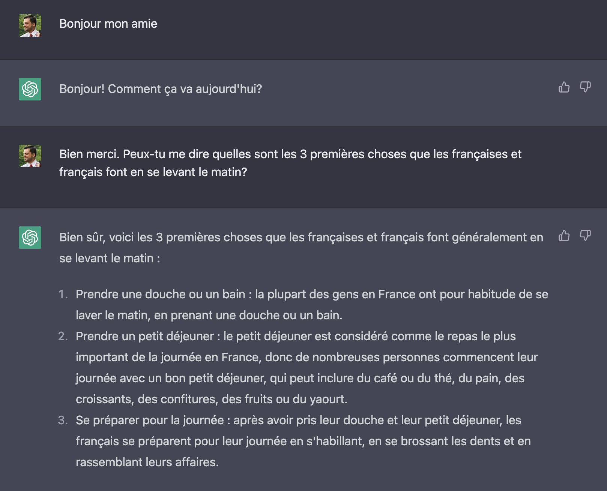
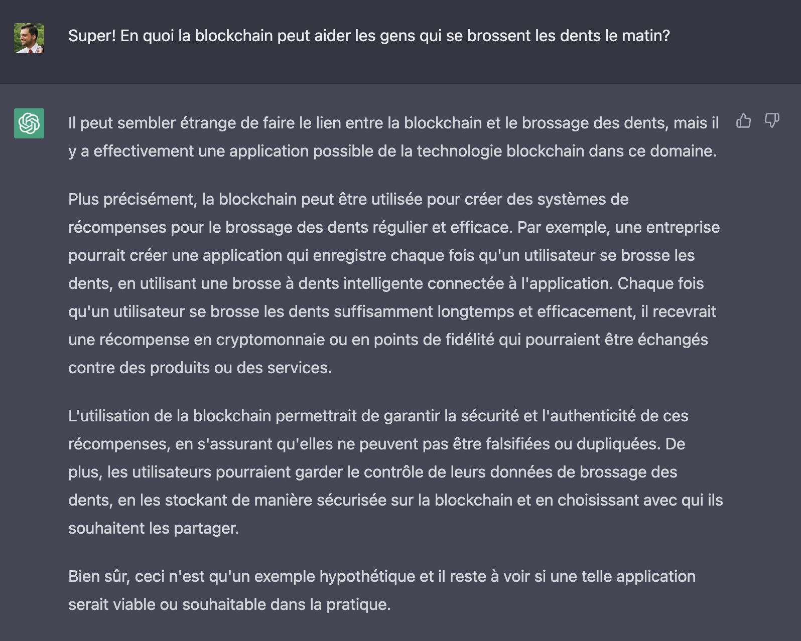
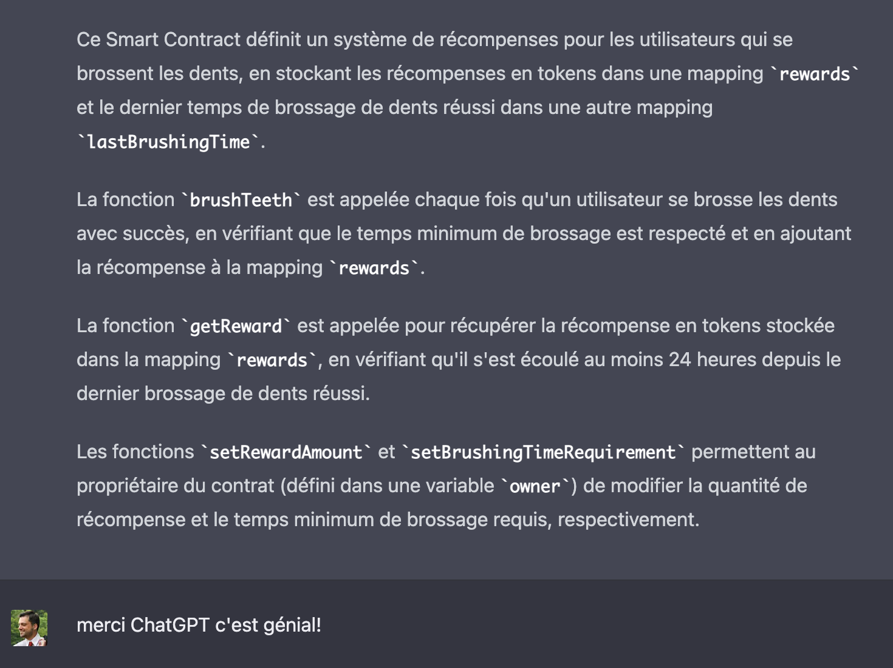

# 02 Cas d'usages

Pour trouver des cas d'usages à la blockchain j'ai demandé à ma nouvelle amie ChatGPT.



Je ne pense pas que se brosser les dents aie à voir avec la blockchain, mais demandons à ChatGPT.



Et juste comme ça, ChatGPT vient d'inventer le Brush2Earn! Gagner de l'argent en se brossant les dents!
Disons que grâce à une nouvelle collab Colg8 x Br0hn c'est maintenant possible. Puis-je avoir le Smart Contract?

```solidity
// SPDX-License-Identifier: MIT
pragma solidity ^0.8.0;

contract ToothbrushRewards {

    mapping(address => uint) public rewards;
    mapping(address => uint) public lastBrushingTime;

    uint public rewardAmount = 100; // La quantité de récompense en tokens pour chaque brossage de dents réussi
    uint public brushingTimeRequirement = 120; // Le temps minimum en secondes pour considérer que le brossage est réussi

    function brushTeeth() public {
        require(lastBrushingTime[msg.sender] == 0 || block.timestamp > lastBrushingTime[msg.sender] + 24 hours, "Vous ne pouvez réclamer qu'une récompense par jour.");
        lastBrushingTime[msg.sender] = block.timestamp;
        rewards[msg.sender] += rewardAmount;
    }

    function getReward() public {
        require(rewards[msg.sender] > 0, "Vous n'avez pas de récompense à réclamer.");
        require(block.timestamp > lastBrushingTime[msg.sender] + 24 hours, "Vous ne pouvez réclamer qu'une récompense par jour.");
        rewards[msg.sender] = 0;
    }

    function setRewardAmount(uint _rewardAmount) public {
        require(msg.sender == owner, "Vous n'êtes pas autorisé à effectuer cette action.");
        rewardAmount = _rewardAmount;
    }

    function setBrushingTimeRequirement(uint _brushingTimeRequirement) public {
        require(msg.sender == owner, "Vous n'êtes pas autorisé à effectuer cette action.");
        brushingTimeRequirement = _brushingTimeRequirement;
    }

}

```



Je ne sais pas si ce contrat est pertinent, mais essayons une implémentation et nous verrons!

## Pourquoi la blockchain?

Ce cas d'usage est intéressant, mais pourquoi utiliser la blockchain plutôt qu'une autre base de données?
En effet, nous aurions pu simplement envoyer les informations de brossage au fabricant qui offre les récompenses et obtenir des euros en échange.

### 1. Confiance

Nous allons utiliser une blockchain qui n'est pas maintenue par le fabricant de brosse à dents mais par un réseau de participants gouvernés par leurs règles propres.
Les informations concernant le dernier brossage seront stockées dans ce Smart Contract et seront associées directement au compte de notre brosse à dents intelligente.
Les informations concernant les récompenses sont égalements décrites dans ce Smart Contract.

On observe qu'il est impossible pour un utilisateur de brosse à dents intelligente de prétendre être un autre utilisateur et faire gagner des récompenses à d'autres utilisateurs.
Il n'est également pas possible pour le fabricant de prétendre ne pas avoir reçu les informations de brossage et de ne pas déclencher la récompense associée.
Les données étant stockées chez un tiers de confiance (la blockchain), le système permet de créer une confiance plus importante qu'avec d'autres systèmes de base de données.

### 2. Transparence

La blockchain étant immutable et "append only", nous avons l'historique des brossages et des récompenses disponibles tant que la blockchain restera en opération.
Ce registre est infalsifiable et toute personne possédant une copie de l'historique peut le parcourir. Ceci peut être important dans des cas de besoins en compliance, ou mise en conformité avec les réglementations.

### 3. Sécurité

Les mécanismes cryptographiques mis en oeuvre sont le fruit de décennies de recherches et sont toujours considérés comme incassables. Personne d'autre que le propriétaire de la clé privé d'un compte ne peut se faire passer pour le propriétaire de l'adresse publique. Nous pouvons alors programmer dans nos Smart Contracts des gestions de droits en écriture garantissant que les informations stockées et échangées ne le sont que par les participants ayant les droits, même si la blockchain reste publique et ouverte à tous.

### 4. Echange de monnaie digitale et d'informations

Nous avons pu échanger des informations entre la brosse à dents intelligente et le fabricant, mais la blockchain permet également l'échange d'une monnaie digitale, ou jeton, ce qui nous permettra d'obtenir les récompenses de notre brossage.
En effet, en fonction du jeton utilisé nous pourrions soit l'échanger contre un autre jeton soit contre de l'euro sur un exchange.
Sans utiliser la blockchain, il aurait été plus difficile pour le fabricant de nous faire parvenir notre récompense en euros. Envoie d'un bon par la poste? Retrait en magasin? Virement bancaire?
